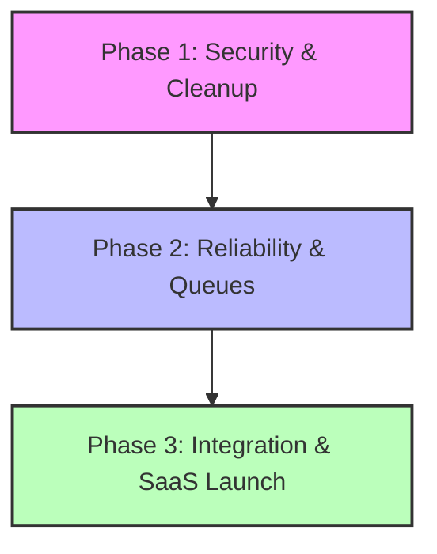

# Brutal Evaluation Report: Golf Huub Marketing Platform

This document presents a rigorous technical, product, and business evaluation of the **Golf Huub** project. It is structured from the perspectives of a **Senior SaaS CTO**, **Startup Investor**, **Thesis Supervisor**, and **CRM/Email Marketing Expert**.

---

## 1. Technical Architecture & Systems Engineering

### 🔴 Scalability & High Availability (CTO Perspective)
*   **The Single-Instance Trap:** Your backend is architected as a stateful, single-instance monolith. The use of in-memory maps for rate limiting (`loginAttempts = new Map()`) and MFA code validation (`global.__mfaStore = new Map()`) means **horizontal scaling is impossible**. If you deploy this behind a load balancer (or in a multi-instance container setup like AWS ECS/Kubernetes), authentication states will be lost, resulting in random MFA failures (error 400 "MFA invalide") and bypassable rate limits.
*   **Event-Loop Blocking & Process Crashes:** The email campaign sending process (`envoyerCampagne` in [emailService.js](file:///c:/Users/Maycem%20Sa%C3%AFdi/OneDrive%20-%20pylon-dw.com/Bureau/Hamza%20Saidi/STUDIES/PFE/golf%20huub-antigravity/backend/services/emailService.js#L310-L437)) runs directly on the Express event loop thread. While you attempt batching with a sleep delay, thousands of database calls and network requests in the main thread will block incoming HTTP requests. A single uncaught rejection during a massive campaign send could crash the entire API server mid-process, leaving the campaign in an orphaned state (`en_cours`).
*   **Cron Scheduler Overlap:** Running `node-cron` directly inside the Express process ([cronService.js](file:///c:/Users/Maycem%20Sa%C3%AFdi/OneDrive%20-%20pylon-dw.com/Bureau/Hamza%20Saidi/STUDIES/PFE/golf%20huub-antigravity/backend/services/cronService.js)) is a classic amateur pattern. If you run multiple instances of your API server, each instance will trigger the crons independently, resulting in **duplicate email sends** (e.g., sending birthday emails multiple times to the same contact).

### 🟡 Database Design & Multi-Tenancy (CTO & Investor Perspective)
*   **No Multi-Tenant Isolation:** The schema ([golf_marketing_schema.sql](file:///c:/Users/Maycem%20Sa%C3%AFdi/OneDrive%20-%20pylon-dw.com/Bureau/Hamza%20Saidi/STUDIES/PFE/golf%20huub-antigravity/sql/golf_marketing_schema.sql)) completely lacks a tenant identifier (e.g., `tenant_id` or `organization_id`). The system assumes a single administrative entity. As a SaaS product, this is a blocker; you cannot host multiple golf clubs on a shared database instance without rebuilding the data model to partition access.
*   **Missing Index Strategy:** There are critical foreign keys (e.g., `contact_tag.tag_id`, `envoi_email.token_tracking`, and dynamic query fields like `contact.sexe`, `contact.ville`) that lack explicit indexes in SQL. While Sequelize manages simple associations, the lack of composite indexes on columns frequently used in dynamic segments will cause severe table scans as database volume scales past 50,000 contacts.

### 🔴 Security & Compliance (CTO & Supervisor Perspective)
*   **Insecure MFA Generation:** Your MFA validation code generator utilizes:
    ```javascript
    const code = ('' + Math.floor(100000 + Math.random() * 900000));
    ```
    `Math.random()` is **not cryptographically secure** and is predictable. Under security audits, this is an automatic fail. You must use Node's `crypto.randomInt(100000, 999999)`.
*   **Lack of Query Validation (SQL Injection Risk):** Dynamic segment rules and query builders (e.g., in `contactController.js` parsing `filterRules` and executing database lookups) must be rigorously validated. If raw user inputs are passed into Sequelize's literal subqueries (like line 125/174: `sequelize.literal(...)`), it creates SQL injection vectors.
*   **Local Disk Storage Dependency:** Storing uploaded files (e.g., attachments, media) in a local `uploads/` folder is incompatible with modern cloud deployments (Docker, AWS Fargate, Vercel). Containers have ephemeral file systems; a redeployment or restart will instantly delete all campaign attachments and uploaded contact lists.

---

## 2. Product Quality & User Experience

### 🟡 Design & UX Consistency (CRM Expert Perspective)
*   **Default Material UI Aesthetics:** The frontend relies on un-customized MUI structures. While clean, it looks like a generic admin template rather than a premium, polished SaaS application. For a luxury sector like golf clubs, the design lacks sophistication (no custom color system matching luxury greens/golds, generic loading indicators, standard spacing).
*   **Poor HTML Rendering Output:** The choice of `SunEditor` as a rich-text editor generates messy, unstructured HTML with absolute inline styles. Modern email clients (especially Outlook and Gmail mobile) will warp and break these layouts. Professional marketing tools use structured drag-and-drop engines that output standard-compliant **MJML** or tables.

### 🔴 Core Workflow Deficiencies (CRM Expert Perspective)
*   **Unverified Unsubscribe Flows:** The unsubscribe system ([unsubscribe.js](file:///c:/Users/Maycem%20Sa%C3%AFdi/OneDrive%20-%20pylon-dw.com/Bureau/Hamza%20Saidi/STUDIES/PFE/golf%20huub-antigravity/backend/routes/abonnement.js)) simply marks the contact as inactive or sets a preference. There is no email verification, no opt-out reason survey, and no granular list management (e.g., opting out of marketing newsletters but keeping tournament notifications).
*   **No Pre-send Verification:** The campaign wizard lets users trigger sends instantly without showing a final summary screen, validation checks (e.g., warning if sending to 0 contacts), or checking whether domain SPF/DKIM records are configured.
*   **Overly Simplistic CRM Logic:** The CRM lacks basic pipeline management, logs of contact interactions (e.g., phone calls, meetings), tasks, or deals. It is essentially an advanced contact list rather than a relational CRM.

---

## 3. Business & Startup Potential

### 🔴 Market Fit & Integration Blockers (Investor Perspective)
*   **API Isolation (The Death of Niche SaaS):** Golf clubs operate using legacy club management softwares (e.g., Chronogolf, Clubessential, Albatros) to track memberships and tee sheet bookings. **No golf club administrator will manually export Excel sheets daily to upload them into your CRM.** Without out-of-the-box API integrations with these primary booking systems, your platform is dead-on-arrival (DoA) in the market.
*   **IP Reputation & Deliverability Economics:** Building a custom SMTP/Graph-based sender means each customer sends from their own server/account, or you route them through a shared IP. If you route through a shared IP without automated bounce parsing, spam complaints tracking (feedback loops), and IP warming, one bad user will blacklist your entire platform's sending capacity, rendering the service useless for other tenants.

---

## 4. Academic Thesis & Graduation Evaluation

### 🟢 Strengths & Academic Value (Supervisor Perspective)
*   **High Functional Coverage:** The project is comprehensive. The combination of email templating, dynamic segmentation, tracking pixels, Graph API integration, and automated crons represents a complete system architecture.
*   **Practical Real-World Logic:** Building automated tracking for openings and link redirection with UTM injection is a great demonstration of full-stack engineering competency.

### 🔴 Academic Criticisms & Code Quality Assumptions
*   **Repository Hygiene (Amateur Code Base):** The presence of duplicate, debug files in production source code (such as `Campagnes.jsx`, `Campaigns.jsx`, `CampagnesFixed.jsx`, `CampaignsCards.jsx`, `CampaignsComplete.jsx`, `CampaignsMinimal.jsx`, `CampaignsRefined.jsx`) looks highly unprofessional. It signals to the jury that the developer struggled with version control and resorted to copy-pasting pages instead of using proper Git branches or writing reusable React components.
*   **Lack of Testing:** There is zero test coverage (no Jest, Mocha, or Cypress configurations). In final-year engineering projects, the lack of unit and integration tests for critical logic (like email parsing or campaign segment filtering) is heavily penalized.

---

## 5. Competitive Comparison

| Feature | Golf Huub | Brevo / Mailchimp | HubSpot |
| :--- | :--- | :--- | :--- |
| **Email Composer** | SunEditor (Generates messy inline HTML) | Drag-and-drop block builder (MJML/JSON native) | Rich, responsive builder with templates |
| **Deliverability** | Custom SMTP / Graph API (No SPF/DKIM tools) | Dedicated SMTP relay servers with bounce feedback loops | Highly optimized shared/dedicated IP pools |
| **Segmentation** | Static/Dynamic SQL-based tags & segments | High-performance Elasticsearch queries | Real-time contact properties tracking |
| **Multi-Tenancy** | None (Single database schema) | Complete multi-account isolation | Complete multi-account isolation |

---

## 6. Critical Remediation Checklist (Before Presentation)

You must fix these high-risk areas before presenting to the jury:

1.  **Codebase Cleanup (Highest Priority):**
    *   Delete all duplicate page files (`CampagnesFixed.jsx`, `CampaignsComplete.jsx`, etc.) from the frontend directory. Keep only the active, clean implementation.
2.  **MFA Security Patch:**
    *   Change `Math.random()` in `authController.js` to `crypto.randomInt()`.
3.  **Error Handling for File Uploads:**
    *   Ensure that if a corrupt Excel file is uploaded, the app returns a clean 400 error rather than crashing the Node process.
4.  **Write at least 5-10 unit tests:**
    *   Implement basic tests for the dynamic criteria parser (`buildContactQueryFromCriteria`) using a testing framework (e.g., Jest) to prove to the jury your code is verified.

---

## 7. Strategic Product Roadmap



*   **Quick Wins (1-2 Weeks):** Clean up duplicate routes, implement proper loading skeletons in place of "Chargement...", and secure the MFA generation method.
*   **Medium-Term (1 Month):** Offload the email queue using **Redis + BullMQ** so that sends are executed asynchronously without blocking the event loop.
*   **Long-Term (3+ Months):** Implement a multi-tenant database layer and build API endpoints for automatic integration with golf club booking tools.

---

## 8. Final Verdict

*   **Can this become a real startup?** No, not in its current state. It is a functional prototype. To make it a viable SaaS, you must implement multi-tenancy, move uploads to cloud storage, solve the IP deliverability issues, and build third-party API syncs.
*   **Is it strong enough for a final-year engineering project?** Yes, it is a very strong project. If you clean up the code organization and explain the architecture clearly, you can easily target a **high grade (A / 16-18 out of 20)**.
*   **Current Development Grade:** **Intermediate**. The feature set is professional-grade, but the structural execution (in-memory state, duplicate code assets, lack of testing) is typical of junior engineers.
